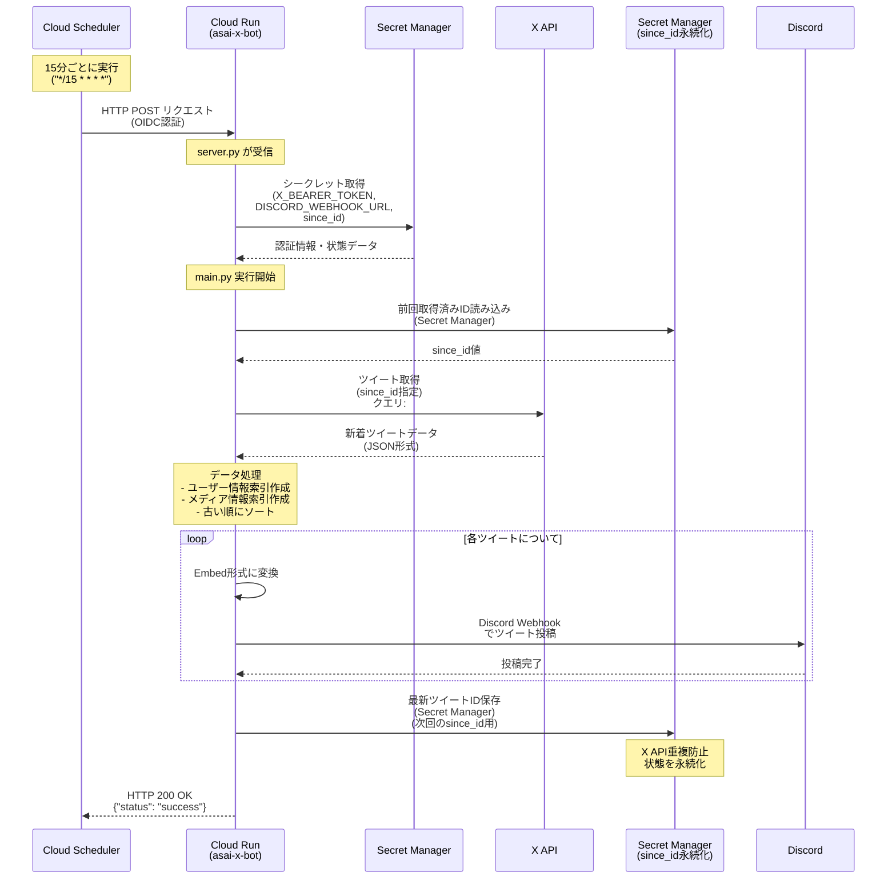
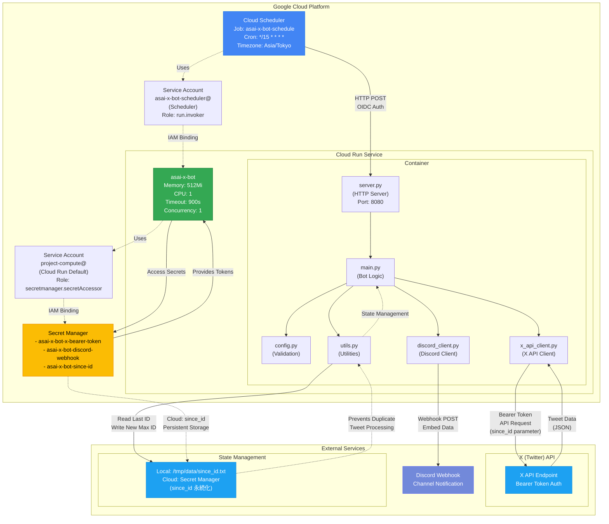

# 浅井恋乃未 X Bot

[](https://github.com/AobaIwaki123/asai-x-bot/actions/workflows/ci.yml)

## 概要

`#浅井恋乃未`がついたポストをX（旧Twitter）から監視し、Discordに自動転送するPython製のbotです。

## 機能

- X APIを使用したリアルタイム投稿監視
- 特定のハッシュタグとアカウントからの投稿を自動検出
- Discord Webhookを使用した自動転送
- 重複投稿の防止（since_id管理・Secret Manager永続化）
- ログ出力による動作状況の可視化

## システム動作フロー

以下は、Cloud SchedulerからDiscordへの投稿転送までの実行シーケンスです：



## 監視対象

以下のクエリで投稿を監視します：

```
(#浅井恋乃未) (from:sakurazaka46 OR from:sakura_joqr OR from:anan_mag OR from:Lemino_official)
```

- `#浅井恋乃未` ハッシュタグが含まれる投稿
- 以下のアカウントからの投稿：
  - `@sakurazaka46` (櫻坂46公式)
  - `@sakura_joqr` (JOQR)
  - `@anan_mag` (anan編集部)
  - `@Lemino_official` (Lemino公式)

## 必要環境

- Python 3.12以上（conda環境推奨）
- Miniconda/Anaconda（conda環境使用の場合）
- X API Bearer Token
- Discord Webhook URL
- Google Cloud Project（Secret Manager使用時）
- Cursor IDE（開発環境として推奨）

## API制限について

⚠️ **重要**: X API v2の制限により、**15分間に1回**のリクエストのみ許可されています。そのため、ボットは15分間隔での実行を推奨します。

## インストール

### 方法1: 自動セットアップ（推奨）

```bash
# リポジトリをクローン
git clone <repository-url>
cd asai-x-bot

# conda環境を自動セットアップ
./setup_conda.sh
```

### 方法2: 手動セットアップ

```bash
# リポジトリをクローン
git clone <repository-url>
cd asai-x-bot

# conda環境を作成・有効化
conda create -n asai python=3.12 -y
conda activate asai

# 依存関係をインストール
# - python-dotenv: 環境変数管理
# - requests: HTTPリクエスト
# - google-cloud-secret-manager: Secret Managerクライアント（Cloud Run用）
pip install -r requirements.txt
```

### 方法3: システムPython使用

```bash
# リポジトリをクローン
git clone <repository-url>
cd asai-x-bot

# 依存関係をインストール
pip install -r requirements.txt
```

## 設定

1. 環境変数ファイルを作成
```bash
cp example.env .env
```

2. `.env`ファイルを編集し、必要な値を設定
```env
X_BEARER_TOKEN=your_x_bearer_token_here
DISCORD_WEBHOOK_URL=your_discord_webhook_url_here
QUERY=(#浅井恋乃未) (from:sakurazaka46 OR from:sakura_joqr OR from:anan_mag OR from:Lemino_official)
```

### 環境変数の説明

- `X_BEARER_TOKEN`: X APIのBearer Token（[X Developer Portal](https://developer.twitter.com/)で取得）
- `DISCORD_WEBHOOK_URL`: DiscordチャンネルのWebhook URL
- `QUERY`: 監視する検索クエリ（必要に応じてカスタマイズ可能）

## 使用方法

### 基本的な実行

#### conda環境使用の場合（推奨）
```bash
# conda環境を有効化
conda activate asai

# ボットを実行
cd src && python run.py
```

#### システムPython使用の場合
```bash
cd src && python run.py
```

### Cursor IDEでの実行

1. Cursor で Python インタープリターを設定：
   - `Cmd+Shift+P` → "Python: Select Interpreter"
   - conda環境 `asai` のPythonパスを選択

2. デバッグ実行：
   - `F5` キーを押して "Python: ASAI Bot" を選択

詳細な開発環境設定は [CURSOR_SETUP.md](CURSOR_SETUP.md) を参照してください。

### 定期実行（cron使用例）

#### conda環境使用の場合
```bash
# 15分ごとに実行（API制限に準拠）
*/15 * * * * cd /path/to/asai-x-bot && /opt/homebrew/Caskroom/miniconda/base/envs/asai/bin/python src/run.py >> logs/bot.log 2>&1
```

#### システムPython使用の場合
```bash
# 15分ごとに実行（API制限に準拠）
*/15 * * * * cd /path/to/asai-x-bot && python src/run.py >> logs/bot.log 2>&1
```

### バックグラウンド実行

```bash
nohup python src/asai-radar.py > bot.log 2>&1 &
```

## ファイル構成

```
asai-x-bot/
├── README.md              # このファイル
├── requirements.txt       # Python依存関係
├── example.env           # 環境変数テンプレート
├── since_id.txt          # 最後に処理した投稿ID（ローカルフォールバック用）
├── deploy-cloud-run.sh   # Cloud Run自動デプロイスクリプト
├── Dockerfile            # コンテナ設定
└── src/
    ├── __init__.py
    ├── config.py         # 設定管理
    ├── main.py           # メイン処理
    ├── run.py            # エントリーポイント
    ├── server.py         # HTTPサーバー
    ├── utils.py          # ユーティリティ関数
    ├── discord_client.py # Discordクライアント
    └── x_api_client.py   # X APIクライアント
```

## 動作の仕組み

1. **初期化**: 環境変数を読み込み、X APIとDiscord Webhookの設定を確認
2. **状態管理**: Secret Manager（Cloud Run）または`since_id.txt`（ローカル）から前回処理した投稿IDを読み込み
3. **投稿検索**: X APIを使用して新しい投稿を検索
4. **重複チェック**: 既に処理済みの投稿はスキップ
5. **Discord転送**: 新しい投稿をDiscord Webhookで転送
6. **状態更新**: 処理した投稿IDをSecret Manager（Cloud Run）またはファイル（ローカル）に保存

## システムアーキテクチャ

以下は、Google Cloud Platform上での全体的なシステム構成です：



## Cloud Run デプロイメント

### 自動デプロイ（推奨）

Google Cloud Runで定期実行するための自動デプロイスクリプトを提供しています：

```bash
# 1. Google Cloud CLIがインストールされていることを確認
gcloud version

# 2. 認証とプロジェクト設定
gcloud auth login
export PROJECT_ID="your-gcp-project-id"
export REGION="asia-northeast1"  # オプション（デフォルト値）

# 3. 自動デプロイ実行
./deploy-cloud-run.sh
```

デプロイスクリプトは以下を自動で実行します：

1. 必要なGoogle Cloud APIの有効化
2. Dockerイメージのビルドとプッシュ
3. Secret Manager でのAPIキー・状態管理
   - X_BEARER_TOKEN
   - DISCORD_WEBHOOK_URL
   - since_id 永続化
4. Cloud Runサービスのデプロイ
5. Cloud Schedulerによる15分間隔の定期実行設定

### 手動デプロイ

#### 1. Dockerイメージの準備

```bash
# イメージのビルド
docker build -t gcr.io/PROJECT_ID/asai-x-bot .

# Google Container Registryにプッシュ
docker push gcr.io/PROJECT_ID/asai-x-bot
```

#### 2. シークレットの作成

```bash
# X API Bearer Token
echo "your-x-bearer-token" | gcloud secrets create asai-x-bot-x-bearer-token --data-file=-

# Discord Webhook URL
echo "your-discord-webhook-url" | gcloud secrets create asai-x-bot-discord-webhook --data-file=-

# Since ID 永続化用（初期値は空）
echo "" | gcloud secrets create asai-x-bot-since-id --data-file=-
```

#### 3. Cloud Runサービスのデプロイ

```bash
gcloud run deploy asai-x-bot \
    --image gcr.io/PROJECT_ID/asai-x-bot \
    --platform managed \
    --region asia-northeast1 \
    --no-allow-unauthenticated \
    --memory 512Mi \
    --cpu 1 \
    --timeout 900 \
    --concurrency 1 \
    --max-instances 1 \
    --set-env-vars "QUERY=(#浅井恋乃未) (from:sakurazaka46 OR from:sakura_joqr OR from:anan_mag OR from:Lemino_official)" \
    --set-env-vars "GOOGLE_CLOUD_PROJECT=PROJECT_ID" \
    --set-secrets "X_BEARER_TOKEN=asai-x-bot-x-bearer-token:latest" \
    --set-secrets "DISCORD_WEBHOOK_URL=asai-x-bot-discord-webhook:latest"
```

#### 4. Cloud Schedulerの設定

```bash
# Service Accountの作成
gcloud iam service-accounts create asai-x-bot-scheduler

# Cloud Run Invoker権限の付与
gcloud run services add-iam-policy-binding asai-x-bot \
    --member="serviceAccount:asai-x-bot-scheduler@PROJECT_ID.iam.gserviceaccount.com" \
    --role="roles/run.invoker" \
    --region=asia-northeast1

# 15分間隔のスケジューラージョブ作成
gcloud scheduler jobs create http asai-x-bot-schedule \
    --location=asia-northeast1 \
    --schedule="*/15 * * * *" \
    --time-zone="Asia/Tokyo" \
    --uri="CLOUD_RUN_URL" \
    --http-method=POST \
    --oidc-service-account-email=asai-x-bot-scheduler@PROJECT_ID.iam.gserviceaccount.com
```

### 設定ファイル

- `Dockerfile`: Cloud Run用のコンテナ設定
- `cloud-run-service.yaml`: Cloud Runサービス設定
- `cloud-scheduler.yaml`: Cloud Scheduler設定
- `deploy-cloud-run.sh`: 自動デプロイスクリプト

### 監視とログ

```bash
# ログの確認
gcloud logging read 'resource.type=cloud_run_revision AND resource.labels.service_name=asai-x-bot' --limit=50

# Schedulerジョブの確認
gcloud scheduler jobs list --location=asia-northeast1

# 手動実行
gcloud scheduler jobs run asai-x-bot-schedule --location=asia-northeast1
```
